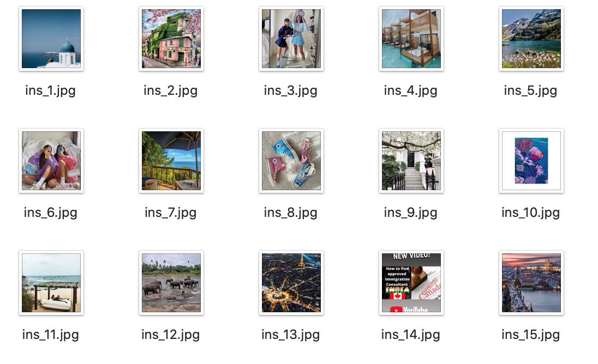
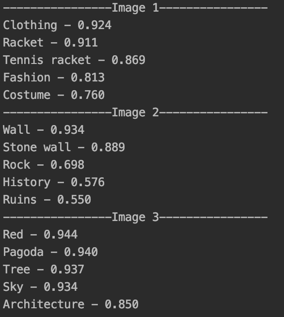
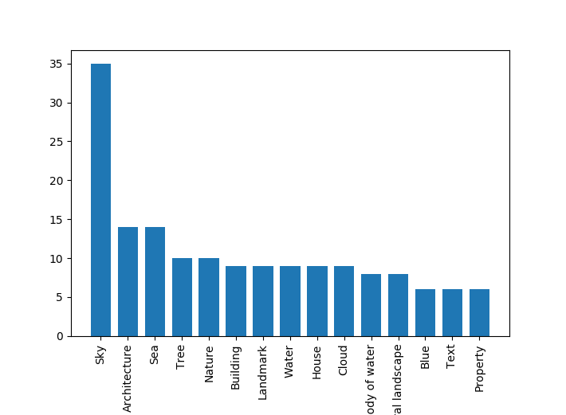

## Q81: What problems have you found developing this section? How did you solve them? 
We did two different runs of this task on Instagram (using Selenium driver) and Reddit (using Reddit APIs)

# Instagram 
Step 1: obtain the last 100 images from the URL entered
We think it will be interested to see the Instagram hashtag #dreamdestination and discover what's the essential element of people's ideal vacation as they are various.
<p align="center"></p>

```
from selenium import webdriver
import time
import urllib
import os

local_path = '/Users/alice/Desktop/google-cloud-vision-example-master/Image'
url = 'ImageURL'
xpath = '//ul[@id="sres"]/li/a/img'

chromeDriver = r'/Users/alice/Downloads/chromedriver'
driver = webdriver.Chrome(chromeDriver)

driver.maximize_window()
img_url_dic = {}
driver.get(url)

pos = 0
m = 0
for i in range(10):
   pos += i * 100
   js = "document.documentElement.scrollTop=%d" % pos
   driver.execute_script(js)
   time.sleep(1)

   for element in driver.find_elements_by_xpath(xpath):
       try:
           img_url = element.get_attribute('src')

           if img_url != None and not img_url in img_url_dic:
               img_url_dic[img_url] = ''
               m += 1
               print(img_url)
               ext = img_url.split('/')[-1]
               filename = str(m) + 'Barcelona' + '_' + ext + '.jpg'
               urllib.urlretrieve(img_url, os.path.join(local_path, filename))

       except OSError:
           print('Error!')
           print(pos)
           break;

driver.close()
```


Step 2-4
<p align="center"></p>
<p align="center"></p>

```
label_scorePair = {}
label_count = []


def main(photo_file):
   """Run a label request on a single image"""

   # [START authenticate]
   service = googleapiclient.discovery.build('vision', 'v1')
   # [END authenticate]

   # [START construct_request]
   with open(photo_file, 'rb') as image:
       image_content = base64.b64encode(image.read())
       service_request = service.images().annotate(body={
           'requests': [{
               'image': {
                   'content': image_content.decode('UTF-8')
               },
               'features': [{
                   'type': 'LABEL_DETECTION',
                   'maxResults': 5
               }]
           }]
       })
       # [END construct_request]
       # [START parse_response]

       response = service_request.execute()
       # print("Results for image %s:" % photo_file)
       for result in response['responses'][0]['labelAnnotations']:
           label = result['description']
           score = result['score']
           label_scorePair.setdefault(label, []).append(score)
           print("%s - %.3f" % (result['description'], result['score']))

       # [END parse_response]


# [START run_application]
if __name__ == '__main__':

   Files = glob.glob("/Users/alice/Desktop/google-cloud-vision-example-master/Image/*.jpg")
   i = 0
   for photo in Files:
       i = i + 1
       print("----------------Image " + str(i) + "----------------")
       main(photo)

   # [START: create_plot: Top 15 labels]
   for key, value in label_scorePair.items():
       label_count.append((key, len(value)))  # label and number of appear time
   label_count = sorted(label_count, key=itemgetter(1), reverse=True)[:15]  # sort the output

   value_x = []
   value_y = []

   for i in label_count:
       value_x.append(i[0])
       value_y.append(i[1])
   plt.bar(range(len(value_x)), value_y, width=0.75, align='center')
   plt.xticks(range(len(value_x)), value_x, rotation=90)
   plt.axis('tight')
   plt.show()
   plt.savefig('Top_15_label.png')
   plt.close()
   # [END create_plot]

# [END run_application]
```

## Q82: How long have you been working on this session? What have been the main difficulties you have faced and how have you solved them?
Approximately 5 hours, did not encounter difficulties when using cloud service but mainly about download the pictures from URL. At first, I tried to download the twitter pictures by tweepy; however, that’s more complicated than I think, especially I was trying to focus on just one hashtag. Then I try to use the expression we learn from the previous lab to scrape and download the pictures from google search and Instagram with selenium and chromedriver ( a tool that allows chrome to act automatically) it worked fine. 


