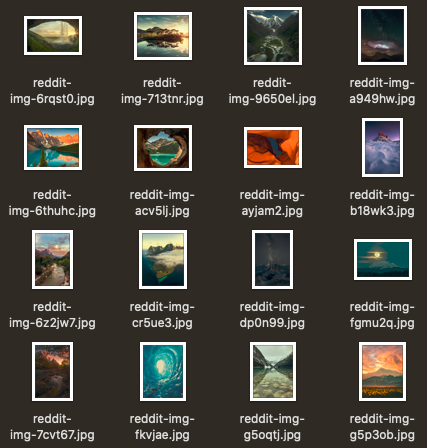
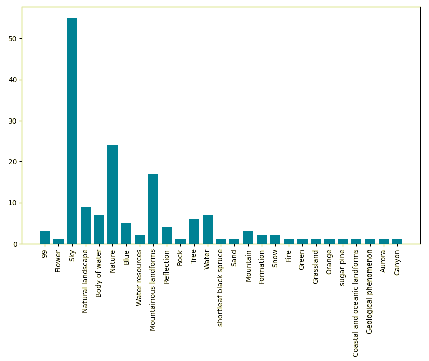
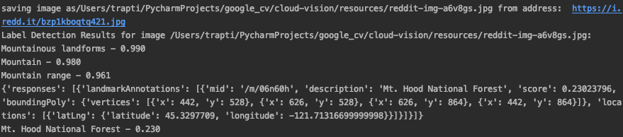

## Q81: What problems have you found developing this section? How did you solve them? 
We did two different runs of this task on Instagram (using Selenium driver) and Reddit (using Reddit APIs):

### A. Instagram 
Step 1: obtain the last 100 images from the URL entered
We think it will be interested to see the Instagram hashtag #dreamdestination and discover what's the essential element of people's ideal vacation as they are various.
<p align="center"></p>

```
from selenium import webdriver
import time
import urllib
import os

local_path = '/Users/alice/Desktop/google-cloud-vision-example-master/Image'
url = 'ImageURL'
xpath = '//ul[@id="sres"]/li/a/img'

chromeDriver = r'/Users/alice/Downloads/chromedriver'
driver = webdriver.Chrome(chromeDriver)

driver.maximize_window()
img_url_dic = {}
driver.get(url)

pos = 0
m = 0
for i in range(10):
   pos += i * 100
   js = "document.documentElement.scrollTop=%d" % pos
   driver.execute_script(js)
   time.sleep(1)

   for element in driver.find_elements_by_xpath(xpath):
       try:
           img_url = element.get_attribute('src')

           if img_url != None and not img_url in img_url_dic:
               img_url_dic[img_url] = ''
               m += 1
               print(img_url)
               ext = img_url.split('/')[-1]
               filename = str(m) + 'Barcelona' + '_' + ext + '.jpg'
               urllib.urlretrieve(img_url, os.path.join(local_path, filename))

       except OSError:
           print('Error!')
           print(pos)
           break;

driver.close()
```


Step 2-4
<p align="center"></p>
<p align="center"></p>

```
label_scorePair = {}
label_count = []


def main(photo_file):
   """Run a label request on a single image"""

   # [START authenticate]
   service = googleapiclient.discovery.build('vision', 'v1')
   # [END authenticate]

   # [START construct_request]
   with open(photo_file, 'rb') as image:
       image_content = base64.b64encode(image.read())
       service_request = service.images().annotate(body={
           'requests': [{
               'image': {
                   'content': image_content.decode('UTF-8')
               },
               'features': [{
                   'type': 'LABEL_DETECTION',
                   'maxResults': 5
               }]
           }]
       })
       # [END construct_request]
       # [START parse_response]

       response = service_request.execute()
       # print("Results for image %s:" % photo_file)
       for result in response['responses'][0]['labelAnnotations']:
           label = result['description']
           score = result['score']
           label_scorePair.setdefault(label, []).append(score)
           print("%s - %.3f" % (result['description'], result['score']))

       # [END parse_response]


# [START run_application]
if __name__ == '__main__':

   Files = glob.glob("/Users/alice/Desktop/google-cloud-vision-example-master/Image/*.jpg")
   i = 0
   for photo in Files:
       i = i + 1
       print("----------------Image " + str(i) + "----------------")
       main(photo)

   # [START: create_plot: Top 15 labels]
   for key, value in label_scorePair.items():
       label_count.append((key, len(value)))  # label and number of appear time
   label_count = sorted(label_count, key=itemgetter(1), reverse=True)[:15]  # sort the output

   value_x = []
   value_y = []

   for i in label_count:
       value_x.append(i[0])
       value_y.append(i[1])
   plt.bar(range(len(value_x)), value_y, width=0.75, align='center')
   plt.xticks(range(len(value_x)), value_x, rotation=90)
   plt.axis('tight')
   plt.show()
   plt.savefig('Top_15_label.png')
   plt.close()
   # [END create_plot]

# [END run_application]
```
### B: Reddit
Using Reddit's REST APIs, we scraped the subreddit 'earthporn' which is a community of landscape photographers and those who appreciate the natural beauty of our home planet.

The code below consists of a function 'get_posts' which scrapes any given subreddit based on a few parameters including count and another function 'print_hist' which displays a histogram of most commonly occuring words in the label annotation from the Vision API. We used another function for leveraging the landmark detection feature of the Google API and obtained landmark features very accurately predicted by the API. Apart from the confidence score, the API also provides geo-locations including boundingPoly vertices which can easily be absorbed by a GIS system. 


<p align="center"></p>

As in the description of the subreddit, the pictures mainly consist of surreal landscapes.

<p align="center"></p>

The most commonly occuring label is the 'Sky', evidently since most of the pictures contain a horizon and the sky is a prominent aspect. Other prominent labels are 'Nature','Mountainous landforms','Trees' and 'Water'. It woudld interesting to correlate these with the number of upvotes the post recieve to understand the reaction of viewers with respect to different aspects of a picture. 

<p align="center"></p>

The response in the above snipped is from the Landmark detection feature. Even though it has a low confidence score, the landmark has been accurately predicted. Apart from the confidence score, the API also provides geo-locations including boundingPoly vertices which can easily be absorbed by a GIS system. It would be interesting to plot these landmarks over a map and create a heatmap based on the number of upvotes any particular image recieved.

Below is the code used to accomplish all 4 steps of the task in section 8.3.4 of the lab assigment.

```
import os, requests
from os.path import isfile
import praw
import pandas as pd
from time import sleep
import operator
import matplotlib.pyplot as plt
from collections import Counter
import glob
import label, landmark


# Get credentials from DEFAULT instance in praw.ini
reddit = praw.Reddit()
download_folder = os.environ['download_loc']


class SubredditScraper:

    def __init__(self, sub, sort='new', lim=100, mode='w'):
        self.sub = sub
        self.sort = sort
        self.lim = lim
        self.mode = mode

        print(
            f'SubredditScraper instance created with values '
            f'sub = {sub}, sort = {sort}, lim = {lim}, mode = {mode}')

    def set_sort(self):
        if self.sort == 'new':
            return self.sort, reddit.subreddit(self.sub).new(limit=self.lim)
        elif self.sort == 'top':
            return self.sort, reddit.subreddit(self.sub).top(limit=self.lim)
        elif self.sort == 'hot':
            return self.sort, reddit.subreddit(self.sub).hot(limit=self.lim)
        else:
            self.sort = 'hot'
            print('Sort method was not recognized, defaulting to hot.')
            return self.sort, reddit.subreddit(self.sub).hot(limit=self.lim)

    def print_hist(self, dict,keys):
        label_scorePair = {x: dict[x] for x in keys}
        print(label_scorePair['label_1'])

        # [START: create_plot: Top 10 labels]
        value_x = Counter(label_scorePair['label_1']).keys()
        value_y=Counter(label_scorePair['label_1']).values()
        print(value_x)
        print(value_y)
        #value_y.pop(i99)
        # value_x = []
        # value_y = []

        # for i in label_count:
        #     value_x.append(i[0])
        #     value_y.append(i[1])
        plt.bar(range(len(value_x)), value_y, width=0.75, align='center')
        plt.xticks(range(len(value_x)), value_x, rotation=90)
        plt.axis('auto')
        plt.show()
        plt.savefig('Top_15_label.png')
        plt.close()
        # [END create_plot]

    def get_posts(self):
        """Get unique posts from a specified subreddit."""

        sub_dict = {
            'title': [], 'url': [], 'id': [], 'sorted_by': [],
            'num_comments': [], 'score': [], 'ups': [], 'downs': [], 'label_1': [], 'lab_score_1': [],
             'label_2': [], 'lab_score_2': [], 'label_3': [], 'lab_score_3': [],
            # 'label_4': [], 'lab_score_4': [], 'label_5': [], 'lab_score_5': [],
            'landmark': [], 'land_score': []}

        csv = f'new_{self.sub}_posts.csv'

        # Attempt to specify a sorting method.
        sort, subreddit = self.set_sort()

        df, csv_loaded = (pd.read_csv(csv), 1) if isfile(csv) else ('', 0)

        print(f'csv = {csv}')
        print(f'After set_sort(), sort = {sort} and sub = {self.sub}')
        print(f'csv_loaded = {csv_loaded}')

        print(f'Collecting information from r/{self.sub}.')
        for post in subreddit:
            unique_id = post.id not in tuple(df.id) if csv_loaded else True
            if ((post.url[-4]) == f'.') and ('redd' == post.url.split('.')[1]):
                if unique_id:
                    sub_dict['title'].append(post.title)
                    sub_dict['url'].append(post.url)
                    sub_dict['id'].append(post.id)
                    sub_dict['sorted_by'].append(sort)
                    sub_dict['num_comments'].append(post.num_comments)
                    sub_dict['score'].append(post.score)
                    sub_dict['ups'].append(post.ups)
                    sub_dict['downs'].append(post.downs)
                    # print(post.url)
                    with open(download_folder + 'reddit-img-' + post.id + '.jpg', 'wb') as out_file:
                        print(
                            'saving image as' + download_folder + 'reddit-img-' + post.id + '.jpg ' + 'from address: ',
                            post.url)
                        r = requests.get(post.url)
                        out_file.write(r.content)
                        for filename in glob.glob(download_folder + 'reddit-img-' + post.id + '.jpg'):
                            if os.stat(filename).st_size < 10485760/1.5:
                                labels = label.main(filename, 3)
                                i = 1
                                for results in labels:
                                    sub_dict['label_' + str(i)].append(results['description'])
                                    sub_dict['lab_score_' + str(i)].append(results['score'])
                                    i += 1
                                try:
                                    landmarks = landmark.main(filename)
                                    sub_dict['landmark'].append(landmarks['description'])
                                    sub_dict['land_score'].append(landmarks['score'])
                                except:
                                    sub_dict['landmark'].append("None")
                                    sub_dict['land_score'].append(0)
                            else:
                                sub_dict['label_1'].append("99")
                                sub_dict['lab_score_1'].append(99)
                                sub_dict['label_2'].append("99")
                                sub_dict['lab_score_2'].append(99)
                                sub_dict['label_3'].append("99")
                                sub_dict['lab_score_3'].append(99)
                                # sub_dict['label_4'].append("99")
                                # sub_dict['lab_score_4'].append(99)
                                # sub_dict['label_4'].append("99")
                                # sub_dict['lab_score_5'].append(99)
                                sub_dict['landmark'].append("99")
                                sub_dict['land_score'].append(99)

                    sleep(0.1)
        #lengths = {key: len(value) for key, value in sub_dict.items()}
        #print(lengths)
        new_df = pd.DataFrame(sub_dict)
       if 'DataFrame' in str(type(df)) and self.mode == 'w':
            pd.concat([df, new_df], axis=0, sort=0).to_csv(csv, index=False)
            print(
                f'{len(new_df)} new posts collected and added to {csv}')
        elif self.mode == 'w':
            new_df.to_csv(csv, index=False)
            print(f'{len(new_df)} posts collected and saved to {csv}')
        else:
            print(
                f'{len(new_df)} posts were collected but they were not '
                f'added to {csv} because mode was set to "{self.mode}"')
        self.print_hist(sub_dict,['label_1', 'lab_score_1'])

if __name__ == '__main__':
    SubredditScraper('earthporn', lim=50, mode='w', sort='top').get_posts()

```

## Q82: How long have you been working on this session? What have been the main difficulties you have faced and how have you solved them?
Approximately 6 hours, did not encounter difficulties when using cloud service but mainly about download the pictures from URL. At first, I tried to download the twitter pictures by tweepy; however, that’s more complicated than I think, especially I was trying to focus on just one hashtag. Then I try to use the expression we learn from the previous lab to scrape and download the pictures from google search and Instagram with selenium and chromedriver ( a tool that allows chrome to act automatically) it worked fine. 


